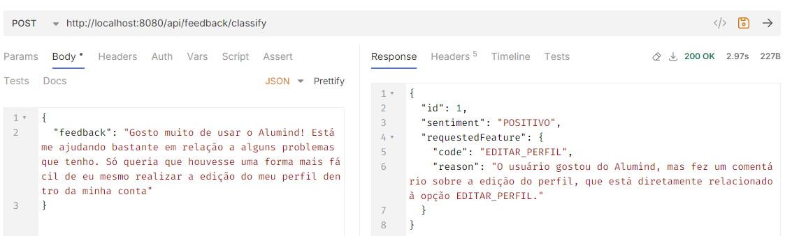
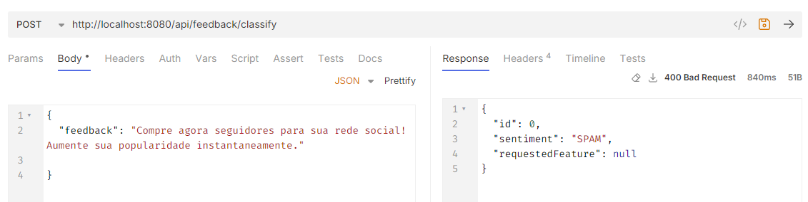

# alura-case-feedbacks

Este repositório contém minha solução para o case proposto na vaga Processo Seletivo Alura | Java LLM.
O desafio se concentra em uma  aplicação que utiliza modelos de linguagem de grande escala (LLM) para classificação de feedbacks recebidos no aplicativo da AluMind.
A LLM escolhida foi o [Llama-3-70b](https://www.llama.com/), à qual tivemos acesso por meio da Groq, que fornece APIs para chamadas de diversos modelos.

A escolha do Llama se deu por ser uma LLM open source que tem mostrado ótimos resultados.

## Criando uma api key para request na Groq

A Groq fornece um [tutorial](https://console.groq.com/docs/quickstart) que explica todo o processo de criação de uma API Key. Após isso, basta definir o valor da chave no arquivo application.properties:

``` application.propeties
spring.application.name=feedback_analyzer
groq.api.url=https://api.groq.com/openai/v1/chat/completions
groq.api.key=${MY_GROQ_API_KEY}
```

## Subindo o Banco de Dados com Docker

Antes de executar a aplicação, é necessário inicializar uma instância MySQL, utilizando o Docker. Na raiz do projeto, execute o arquivo docker-compose.yml com o comando abaixo

````
docker-compose up -d 
````

## Executando o projeto 

Na pasta onde está o arquivo pom.xml, usaremos o Maven para instalar as dependências listadas no arquivo. Em seguida iremos executar o projeto.
Execute o comando abaixo:

```maven
mvn clean install
mvn spring-boot:run
```
Caso o Maven não esteja instalado em sua máquina, uma versão wrapper está incluída neste projeto na pasta .mvn
## Classificando Feedbacks
Para classificar um feedback, envie uma requisição POST para o endpoint da aplicação:
+ Endpoint: http://localhost:8080/api/feedback/classify
+ Formato da Request(Exemplo):

``` json
{
  "feedback": "Gosto muito de usar o Alumind! Está me ajudando bastante em relação a alguns problemas que tenho. Só queria que houvesse uma forma mais fácil de eu mesmo realizar a edição do meu perfil dentro da minha conta"
}
```
Após enviar a requisição, a aplicação retornará a classificação do feedback com base no modelo LLM Llama-3-70b.

## Respostas obtidas(sentimentos/spam)






## Nova feature/Sugestão

A última etapa do case é sugerir uma nova feature.
Para a última etapa do case, sugiro uma nova funcionalidade que pode trazer melhorias significativas para o sistema: a implementação de um [ensemble](https://en.wikipedia.org/wiki/Ensemble_averaging_(machine_learning)) de classificadores.

A ideia é utilizar múltiplos classificadores para avaliar cada feedback. Cada um desses classificadores emitiria uma "votação" sobre a classificação (positiva ou negativa) do feedback, e o resultado final seria definido com base no voto da maioria. Essa abordagem permite aumentar a precisão, pois combina as previsões de diversos modelos, reduzindo o impacto de erros individuais. Com isso, espera-se que a detecção de sentimentos seja mais robusta e consistente.

Considerando o código que já temos, substituir a LLM (Large Language Model) responsável pela classificação é uma tarefa relativamente simples. Isso se deve ao fato de o sistema ter sido projetado com uma interface chamada Classifier. Essa interface define os métodos e comportamentos esperados para qualquer modelo de classificação, independentemente da implementação específica.

Assim, para trocar o classificador, basta criar uma nova implementação que siga essa interface, sem a necessidade de modificar o restante do código.